# COVID-19
<div style="text-align: justify;">
Este repositorio incluye datasets con los eventos registrados del COVID-19 desde 10 de Enero del 2020, hasta el 24 de Marzo del 2024.
<p>

**La información lo pueden encontrar en la siguiente dirección:**
- https://ourworldindata.org/covid-deaths

</div>


## EXPLORACIÓN DE DATOS:
<div style="text-align: justify;">
En esta etapa se realizo una exploración de datos con respecto a la información obtenida del COVID-19, en este proceso se analizo y visualizan los datos relacionados con la pandemia. Durante esta exploración, se pudo ver el número de casos confirmados, tasas de mortalidad, distribución geográfica, efectividad de las vacunas y más.
</div>


## SQL QUERIES:
Total de casos vs Total de muertes.

``` sql

SELECT [location], [date], [total_cases], [total_deaths], 
      CAST([total_deaths] AS float) / CAST([total_cases] AS float) *100 AS Deathpercentage
FROM [dbo].[covid-data-deaths]
ORDER BY 1, 2;
```
Probabilidad de morir si nos contagiamos de COVID en Ecuador.

```sql
SELECT [location], [date], [total_cases], [total_deaths], 
      CAST([total_deaths] AS float) / CAST([total_cases] AS float) *100 AS Deathpercentage
FROM [dbo].[covid-data-deaths]
WHERE location LIKE '%Ecuador%'
and [continent] is not null
ORDER BY 1, 2;
```
Total de casos vs la Población, aquí se muestra que porcentaje de población tiene COVID.

```sql
SELECT [location], [date], [population],[total_cases], 
      CAST([total_cases] AS float) / CAST( [population]AS float) *100 AS PercentPopulationInfected
FROM [dbo].[covid-data-deaths]
ORDER BY 1, 2;
```
Países con tasas de infección mas alta en comparación con la población.
```sql
SELECT [location], [population], MAX([total_cases]) as HighestInfectionCount, 
      MAX(CAST([total_cases] AS float)) / CAST([population] AS float) * 100 AS PercentPopulationInfected
FROM [dbo].[covid-data-deaths]
GROUP BY [location], [population]
ORDER BY PercentPopulationInfected DESC
```
Países con mayor número de muertes por población.
```sql
SELECT [location], MAX(CAST([total_deaths] AS Int)) AS TotalDeathCount
FROM [dbo].[covid-data-deaths]
WHERE [continent] IS NOT NULL
GROUP BY [location]
ORDER BY TotalDeathCount DESC
```
Continentes con mayor número de muertos por población.
```sql
SELECT [continent], MAX(CAST([total_deaths] AS Int)) AS TotalDeathCount
FROM [dbo].[covid-data-deaths]
WHERE [continent] IS NOT NULL
GROUP BY [continent]
ORDER BY TotalDeathCount DESC
```
Números globales, en caso de filtrar por fecha el número de casos.
```sql
SELECT [date], SUM([new_cases]) AS [total_cases],SUM(CAST([new_deaths] AS INT)) AS [total_deaths],
      CASE WHEN SUM([new_cases]) > 0 THEN (SUM(CAST([new_deaths] AS INT)) / NULLIF(SUM([new_cases]), 0)) * 100 
      ELSE NULL END AS DeathPercentage
FROM [dbo].[covid-data-deaths]
WHERE [continent] IS NOT NULL
GROUP BY [date]
ORDER BY 1, 2;
```
Verificamos por el número total de casos en el mundo.
```sql
SELECT SUM([new_cases]) AS [total_cases], SUM(CAST([new_deaths] AS INT)) AS [total_deaths], 
	   SUM(CAST([new_deaths] AS INT)) /SUM([new_cases]) *100 AS DeathPercentage
FROM [dbo].[covid-data-deaths]
WHERE [continent] IS NOT NULL
ORDER BY 1, 2;
```
Población total vs Vacunación
```sql
SELECT dea.[continent], dea.[location], dea.[date], dea.[population], vac.[new_vaccinations],
SUM(CONVERT(bigint, vac.new_vaccinations)) OVER (Partition by dea.[location] ORDER BY dea.[location], dea.[Date])
AS RollingPeopleVaccinated
FROM [dbo].[covid-data-deaths] dea
JOIN [dbo].[covid-data-vaccinations] vac
	ON dea.[location] = vac.[location]
	AND dea.[date] = vac.[date] 
WHERE dea.[continent] IS NOT NULL
ORDER BY 2, 3
```
Uso de CTE para realizar el cálculo de la partición mediante la consulta anterior

```sql
WITH PopvsVac ([Continent], [Location], [Date], [Population], [new_vaccinations], RollingPeopleVaccinated)
AS
(SELECT dea.[continent], dea.[location], dea.[date], dea.[population], vac.[new_vaccinations],
SUM(CONVERT(bigint, vac.new_vaccinations)) OVER (Partition by dea.[location] ORDER BY dea.[location], dea.[Date])
AS RollingPeopleVaccinated
FROM [dbo].[covid-data-deaths] dea
JOIN [dbo].[covid-data-vaccinations] vac
	ON dea.[location] = vac.[location]
	AND dea.[date] = vac.[date] 
WHERE dea.[continent] IS NOT NULL)
SELECT *, (RollingPeopleVaccinated/Population)*100
FROM PopvsVac
```
Uso de la tabla temporal para realizar el cálculo de la partición en la consulta anterior

```sql
DROP TABLE IF EXISTS #PercentPopulationVaccinated
CREATE TABLE #PercentPopulationVaccinated
(
[Continent] NVARCHAR(255),
[Location] nvarchar(255),
[Date] datetime,
[Population] numeric,
new_vaccinations numeric,
RollingPeopleVaccinated numeric
)

INSERT INTO #PercentPopulationVaccinated 
SELECT dea.[continent], dea.[location], dea.[date], dea.[population], vac.[new_vaccinations],
SUM(CONVERT(bigint, vac.new_vaccinations)) OVER (Partition by dea.[location] ORDER BY dea.[location], dea.[Date])
AS RollingPeopleVaccinated
FROM [dbo].[covid-data-deaths] dea
JOIN [dbo].[covid-data-vaccinations] vac
	ON dea.[location] = vac.[location]
	AND dea.[date] = vac.[date] 

SELECT *, (RollingPeopleVaccinated/Population)*100
FROM #PercentPopulationVaccinated
```
Creación de vista para almacenar datos para visualizaciones posteriores. 
```sql
CREATE VIEW PercentPopulationVaccinated AS
SELECT dea.[continent], dea.[location], dea.[date], dea.[population], vac.[new_vaccinations],
SUM(CONVERT(bigint, vac.new_vaccinations)) OVER (Partition by dea.[location] ORDER BY dea.[location], dea.[Date])
AS RollingPeopleVaccinated
FROM [dbo].[covid-data-deaths] dea
JOIN [dbo].[covid-data-vaccinations] vac
	ON dea.[location] = vac.[location]
	AND dea.[date] = vac.[date]
WHERE [dea].[continent] IS NOT NULL

/*Verificamos nuestra vista*/

SELECT *
FROM PercentPopulationVaccinated
```
# LIMPIEZA DE DATOS CON SQL QUERIES

<div style="text-align: justify;">
 En esta sección realizaremos una exploración y limpieza de datos del archivo "Nashville Housing Data for Data Cleaning", este archivo excel a sido previamente cargado a nuestro SQL Management Studio para poder realizar su respectiva limpieza.
</div>

## QUERIES SQL

Estandarizar el formato de fechas.
```sql
SELECT [SaleDateConverted], CONVERT(DATE, [SaleDate])
FROM [dbo].[Nashville-Housing]

UPDATE [Nashville-Housing]
SET [SaleDate] = CONVERT(DATE, [SaleDate])

/* En caso de que no se actualiza correctamente */

ALTER TABLE [Nashville-Housing] 
ADD [SaleDateConverted] DATE;

UPDATE [Nashville-Housing]
SET [SaleDateConverted] = CONVERT(DATE, [SaleDate])
```

Completar datos de dirección de propiedad.
```sql
SELECT *
FROM [dbo].[Nashville-Housing]
--WHERE [PropertyAddress] IS NULL
ORDER BY [ParcelID]

/*Realizamos una auto-union para comparar y completar datos*/

SELECT a.[ParcelID], a.[PropertyAddress], b.[ParcelID], b.[PropertyAddress], ISNULL(a.[PropertyAddress],b.[PropertyAddress])
FROM dbo.[Nashville-Housing] a
JOIN dbo.[Nashville-Housing] b
	on a.[ParcelID] = b.[ParcelID]
	AND a.[UniqueID ] <> b.[UniqueID ]
WHERE a.[PropertyAddress] IS NULL

/*Actualizamos la información*/

UPDATE a
SET [PropertyAddress] = ISNULL(a.[PropertyAddress],b.[PropertyAddress])
FROM dbo.[Nashville-Housing] a
JOIN dbo.[Nashville-Housing] b
    on a.[ParcelID] = b.[ParcelID]
    AND a.[UniqueID ] <> b.[UniqueID ]
WHERE a.[PropertyAddress] IS NULL
```
Dividir la dirección en columnas individuales (Dirección, Ciudad, Estado).
```sql
SELECT [PropertyAddress]
FROM [dbo].[Nashville-Housing]

/*Utilizamos SUBSTRING y CHARINDEX*/
SELECT
SUBSTRING([PropertyAddress], 1, CHARINDEX(',', [PropertyAddress]) -1) AS [Address],
SUBSTRING([PropertyAddress], CHARINDEX(',', [PropertyAddress]) + 1, LEN([PropertyAddress])) AS [City]
FROM [dbo].[Nashville-Housing]

/* Creamos columnas nuevas*/

ALTER TABLE [Nashville-Housing]
ADD [PropertySplitAddress] NVARCHAR(255);

ALTER TABLE [Nashville-Housing]
ADD [PropertySplitCity] NVARCHAR(255);

/*Actualizamos la información*/

UPDATE [Nashville-Housing]
SET [PropertySplitAddress] = SUBSTRING([PropertyAddress], 1, CHARINDEX(',', [PropertyAddress]) -1)

UPDATE [Nashville-Housing]
SET [PropertySplitCity] = SUBSTRING([PropertyAddress], CHARINDEX(',', [PropertyAddress]) + 1, LEN([PropertyAddress]))

SELECT *
FROM [dbo].[Nashville-Housing]
```
Método mas sencillo para realizar la partición de datos de acuerdo a lo anterior.
```sql
SELECT [OwnerAddress]
FROM [dbo].[Nashville-Housing]

SELECT 
PARSENAME(REPLACE(OwnerAddress, ',', '.') , 3)
,PARSENAME(REPLACE(OwnerAddress, ',', '.') , 2)
,PARSENAME(REPLACE(OwnerAddress, ',', '.') , 1)
FROM [dbo].[Nashville-Housing]

/*Alteramos columnas y actualizamos la información*/

ALTER TABLE [Nashville-Housing]
ADD [OwnerSplitAddress] NVARCHAR(255);

UPDATE [Nashville-Housing]
SET [OwnerSplitAddress] = PARSENAME(REPLACE(OwnerAddress, ',', '.') , 3)

ALTER TABLE [Nashville-Housing]
ADD [OwnerSplitCity] NVARCHAR(255);

UPDATE [Nashville-Housing]
SET [OwnerSplitCity] = PARSENAME(REPLACE(OwnerAddress, ',', '.') , 2)

ALTER TABLE [Nashville-Housing]
ADD [OwnerSplitState] NVARCHAR(255);

UPDATE [Nashville-Housing]
SET [OwnerSplitState] = PARSENAME(REPLACE(OwnerAddress, ',', '.') , 1)

SELECT *
FROM [dbo].[Nashville-Housing]
```
Cambie Y por Yes y N por No en el campo "Sold as Vacant"
```sql
SELECT DISTINCT([SoldAsVacant]), COUNT([SoldAsVacant])
FROM [dbo].[Nashville-Housing]
GROUP BY [SoldAsVacant]
ORDER BY 2

/*Seleccionamos y reemplazamos*/

SELECT [SoldAsVacant]
, CASE WHEN [SoldAsVacant] = 'Y' THEN 'Yes'
       WHEN [SoldAsVacant] = 'N' THEN 'No'
       ELSE [SoldAsVacant]
       END
FROM [dbo].[Nashville-Housing]

/*Actualizamos la información*/

UPDATE [Nashville-Housing]
SET [SoldAsVacant] = CASE WHEN [SoldAsVacant] = 'Y' THEN 'Yes'
       WHEN [SoldAsVacant] = 'N' THEN 'No'
       ELSE [SoldAsVacant]
       END
```
Eliminamos duplicados
```sql
WITH [RowNumCTE] AS(
SELECT *,
    ROW_NUMBER() OVER (
    PARTITION BY [ParcelID],
                 [PropertyAddress],
                 [SalePrice],
                 [SaleDate],
                 [LegalReference]
                 ORDER BY
                    [UniqueID]
                    ) row_num
FROM [dbo].[Nashville-Housing]
--ORDER BY ParcelID
)
SELECT *
--DELETE
FROM [RowNumCTE]
WHERE row_num > 1
ORDER BY [PropertyAddress]
```
Eliminar columnas innecesarias
```sql
SELECT *
FROM [dbo].[Nashville-Housing]

ALTER TABLE [Nashville-Housing]
DROP COLUMN [OwnerAddress], [TaxDistrict], [PropertyAddress], [SaleDate]
```
# PROCESAMIENTO DE DATOS EN EXCEL

En este proyecto se realizara desde lo mas básico hasta lo mas avanzado en una limpieza de datos. Primero separaremos los datos en distintas hojas, desde el Area de trabajo, tablas dinámicas, y dashboards. 

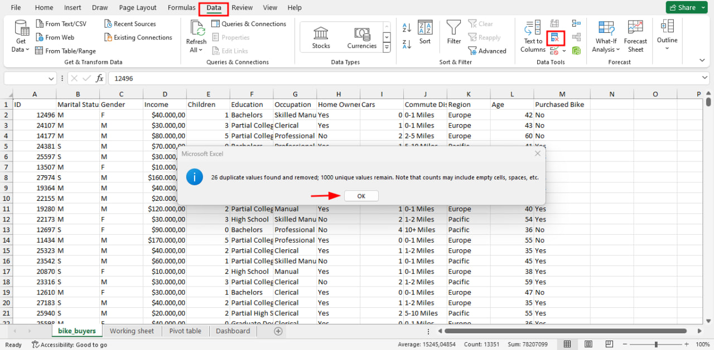


Comenzamos con la eliminación de datos duplicados.

Asignamos la nomenclatura correcta a los datos, tanto para el estado marital, como para el genero.

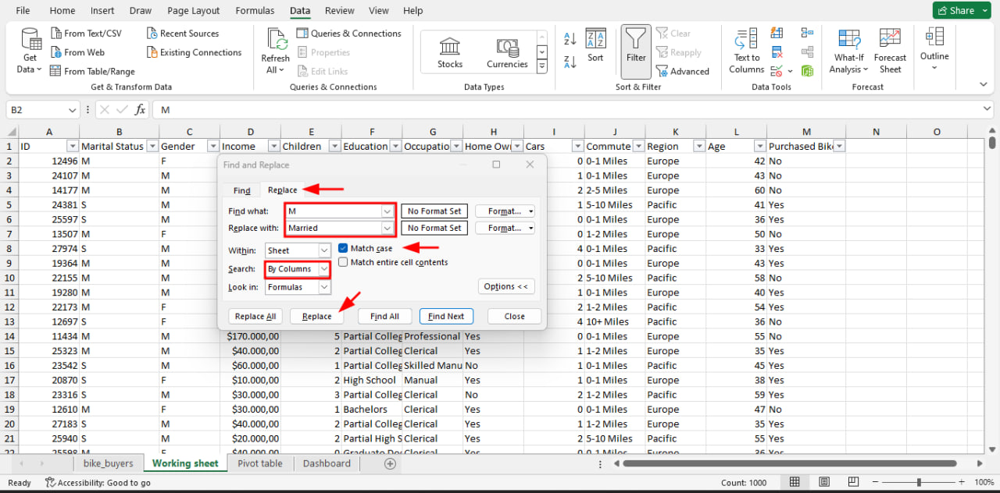
A continuación transformamos el tipo de cambio en la columna de Ingreso. También verificamos inconsistencias, como por ejemplo en la edad. 

Cuando se tiene un grupo o un rango de edad, podemos crear corchetes alrededor de esto para condensarlos y hacerlo mas fácil de entender, lo que podemos hacer es usar una condicional anidada para decir si es mayor o menor que, y darles los rangos que creamos necesarios.

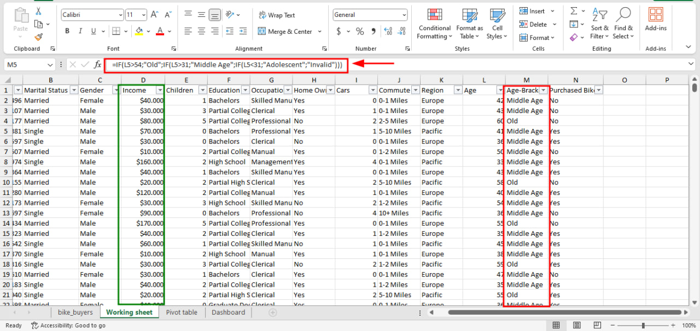

Procederemos a crear nuestras tablas dinámicas para ayudarnos a visualizar, y de acuerdo a lo 

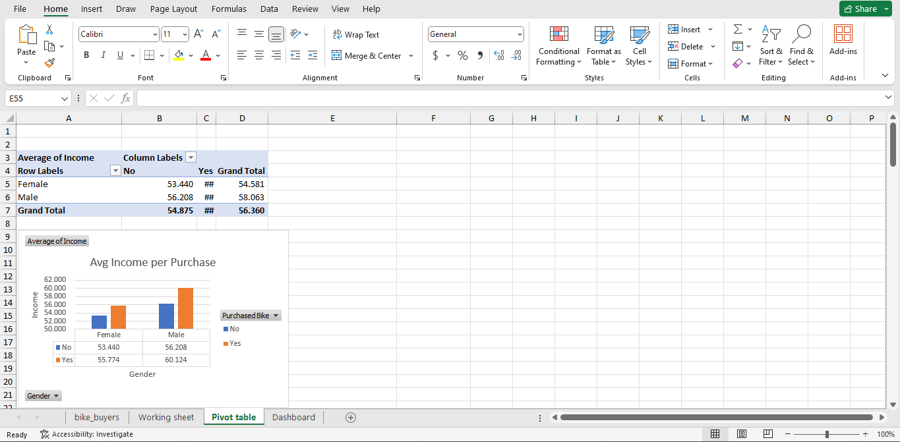

Finalmente cuando hayamos completado nuestras tablas dinámicas, podremos realizar Dashboards, esto nos permitirá monitorizar, analizar y mostrar de manera visual los indicadores de nuestra información.

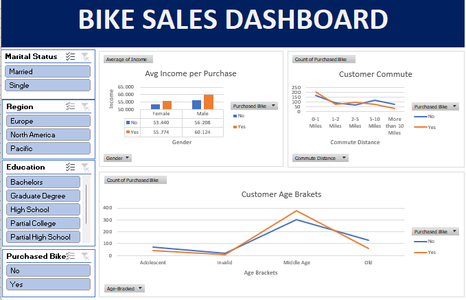

# AIRBNB ANALYSIS DATASET - TABLEAU 

Desde 2008, **Airbnb** ha revolucionado la forma en que viajamos, ofreciendo a huéspedes y anfitriones la oportunidad de crear experiencias de viaje únicas y personalizadas en todo el mundo. Hoy en día, Airbnb se ha convertido en un servicio globalmente reconocido, y el análisis de datos de millones de listados en su plataforma juega un papel fundamental en su funcionamiento. Estos datos no solo son vitales para garantizar la seguridad de los usuarios, sino que también son una herramienta invaluable para la toma de decisiones empresariales, entender el comportamiento de los clientes y anfitriones, dirigir estrategias de marketing y desarrollar nuevos servicios innovadores.

Para este proyecto practico se utilizo la data del repositorio Kaggle.

Podemos usar el siguiente enlace:
* [Airbnb Listings 2016 Dataset | Kaggle](https://www.kaggle.com/code/chirag9073/airbnb-analysis-visualization-and-prediction)

**Contamos con tres conjuntos de datos:**
* Full Project
* Sheet_name = Calendar
* Sheet_name = Reviews

**Estrategia de trabajo:**
1. Analizar y explorar los datos
2. Visualización de datos

## Price By ZipCode

Cuando alguien quiere comenzar un negocio en Airbnb y está buscando la mejor ubicación para comprar una casa y alquilarla, hay varios factores a considerar:

1. **Demanda del mercado:** Qué áreas hay una alta demanda de alquileres de Airbnb. Lugares turísticos, zonas céntricas o cerca de eventos y atracciones suelen ser buenas opciones.

2. **Rentabilidad:** Cuánto se podría cobrar por noche en alquiler y comparar con el precio de compra de la propiedad. Nos aseguramos de que los ingresos superen los gastos, como el pago de la hipoteca, impuestos, mantenimiento y limpieza.

3. **Ubicación de los dormitorios:** Los huéspedes suelen preferir dormitorios privados y cómodos. Una casa con varias habitaciones, preferiblemente con baños privados, puede atraer a más huéspedes y permitirte cobrar tarifas más altas.

## Price By ZipCode
"Esta gráfica ilustra los códigos postales donde es posible obtener tarifas más altas por alquilar en Airbnb."

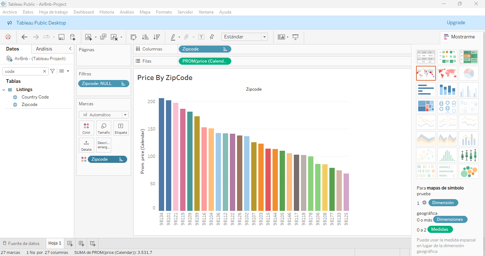

## Map By ZipCode
Cuando trabajamos con datos de ubicación, es crucial ser conscientes de la precisión en el uso de coordenadas, ya que cualquier desviación puede alterar significativamente nuestros resultados.

Si nos referimos a la gráfica anterior que muestra los códigos postales con tarifas más altas en Airbnb, podríamos analizar si la ubicación es verdaderamente atractiva y conveniente para los potenciales huéspedes.

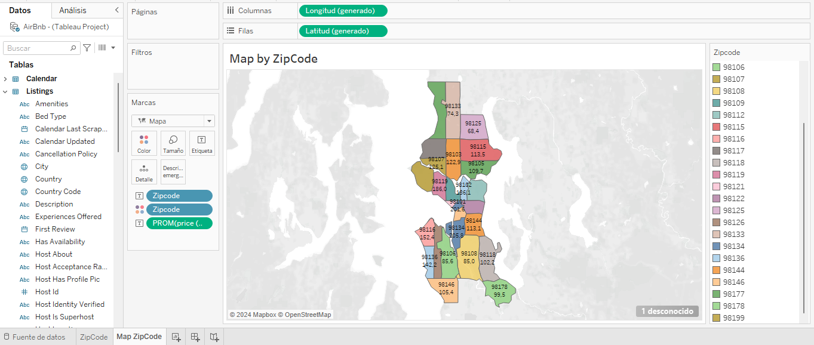

## Revenue Per Year

Para determinar las mejores temporadas para poner tu propiedad en el mercado de Airbnb, podemos utilizar el calendario y analizar los datos por días, meses o semanas, dependiendo de la mejor manera de representar la información.

Observando el patrón a lo largo del año, podemos notar que desde principios de enero hasta febrero la demanda es baja. Sin embargo, a medida que avanzamos hacia finales de año, hay un incremento notable en la ocupación. Este aumento puede atribuirse a las vacaciones, visitas familiares y actividades de fin de año. Además, durante el verano también se observa un aumento significativo en la demanda.

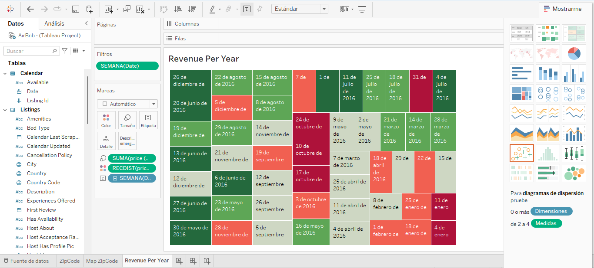

## Promedio - Price Per Bedroom

Al investigar cómo ciertas características influyen en el precio de un alquiler en Airbnb. Por ejemplo, el número de dormitorios, el tamaño de la casa y otros aspectos pueden tener un impacto significativo en el costo.

Es probable que una propiedad con más dormitorios tenga un precio más alto, ya que puede alojar a más huéspedes. Del mismo modo, una casa más grande o con características especiales, como piscina o vista panorámica, podría justificar tarifas más altas.

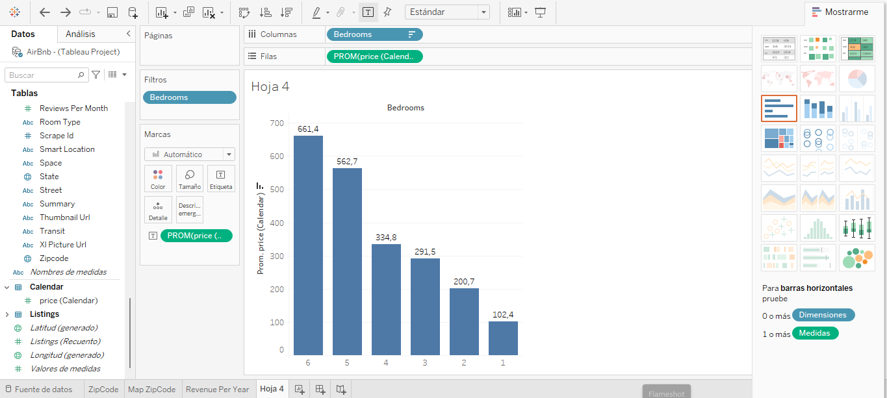

## Distinct Count of Bedroom Listings

Al estudiar la competencia en el mercado de Airbnb, podemos observar cómo la disponibilidad de propiedades con diferentes números de dormitorios afecta la demanda. Si encontramos que hay menos competencia en un determinado rango de dormitorios, es probable que haya una mayor demanda por ese tipo de propiedad.

Esto nos lleva a hacer preguntas de seguimiento importantes, como:
- ¿En qué áreas hay menos competencia en términos de número de dormitorios?
- ¿Qué características específicas hacen que estas propiedades sean más demandadas?
- ¿Cómo podemos capitalizar esta información para maximizar nuestros ingresos en Airbnb?
- ¿Hay oportunidades para diferenciar nuestra propiedad y destacar en un mercado menos saturado?
- ¿Cómo podemos ajustar nuestra estrategia de precios y marketing en función de esta información?"

Al responder a estas preguntas, podemos obtener una comprensión más completa de cómo se ve la competencia en términos de dormitorios en el mercado de Airbnb y tomar decisiones estratégicas más informadas.

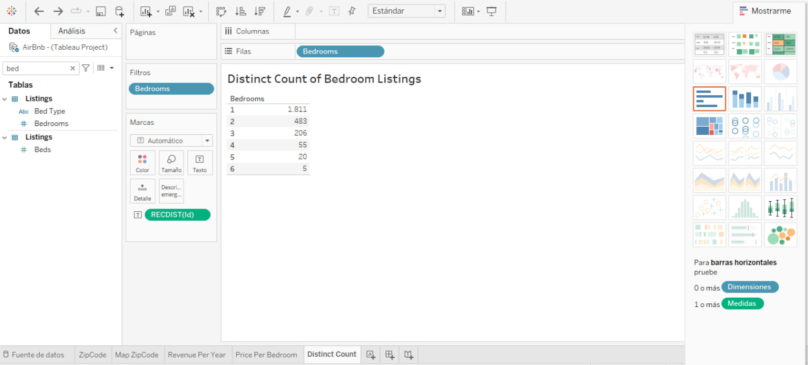

## Dashboard
**Puntos a considerar:**

1. **Ubicación óptima:** Para iniciar un negocio en Airbnb, es crucial elegir una ubicación con alta demanda turística y conveniencia para los huéspedes.
2. **Factores a considerar:** La rentabilidad, la comodidad de los dormitorios, la proximidad a atracciones locales son factores clave a evaluar.
3. **Mejores temporadas:** Basándose en el análisis del calendario, se identificó que el verano y finales de año suelen ser las mejores temporadas para alquilar en Airbnb debido al aumento de la demanda.
4. **Impacto en el precio:** Características como el número de dormitorios, el tamaño de la casa y otras comodidades influyen en el precio de alquiler. Propiedades con menos competencia en ciertos aspectos pueden experimentar una mayor demanda.
5. **Preguntas de seguimiento:** Se plantean preguntas clave para comprender mejor la competencia, identificar oportunidades de mercado y optimizar la estrategia de alquiler en Airbnb.

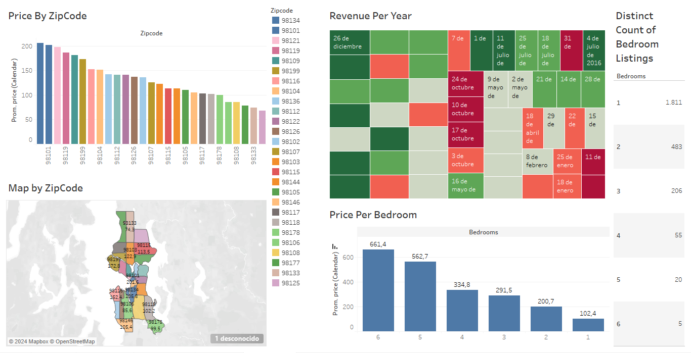